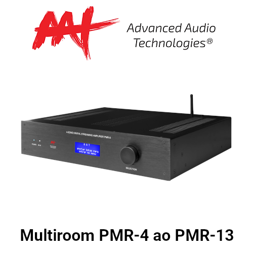

<!--/Controlart.html)-->
# ControlArt 💡
[](https://github.com/Matioliflavio/RTI-Drivers/raw/master/ControlArt%20v0.34.rtidriver)
 
Driver de controle para mdulos sem fio xBus e Módulos cabeados.  
[📃 Documentação](https://docs.google.com/document/d/1x7njGneO6W4oGCM__tr-wER8Rpgwkz-W38y99eORL5Y/edit?usp=sharing)  
[📺 Como configurar](https://youtu.be/4LRs-2Ro52w)  
[📺 Função Hold na entrada de pulso](https://youtu.be/mfD7mNyFfBk)  
[📥versão 0.34](https://github.com/Matioliflavio/RTI-Drivers/raw/master/ControlArt%20v0.34.rtidriver)  
💰 _Valor R$250,00_    
    
---  
  
<!--/Embrace.html)-->
# Embrace 💡
[](https://github.com/Matioliflavio/RTI-Drivers/raw/master/Embrace%20v1.0.rtidriver)
 
Driver de controle para sistema Embrace de iluminação e cortinas/persianas.  
[📃 Documentação](https://github.com/Matioliflavio/RTI-Drivers/raw/master/Documenta%C3%A7%C3%A3o/Embrace.pdf)  
[👨‍💻 Exemplo](https://github.com/Matioliflavio/RTI-Drivers/raw/master/Exemplos/Embrace.apex)  
[📥versão 1.0](https://github.com/Matioliflavio/RTI-Drivers/raw/master/Embrace%20v1.0.rtidriver)  
💰 _Valor R$500,00_  
    
---  
  
<!--/MolSmart.html)-->
# MolSmart 💡
[](https://github.com/Matioliflavio/RTI-Drivers/raw/master/MolSmart%20v1.4.rtidriver)
 
Driver de controle para mdulos 6 Dimmer, 8ch, 16ch e 32ch.  
[📃 Documentação](https://docs.google.com/document/d/1Uc_R1vktYjYXj1EV_bmM8lNKdLZ9OP9EYyhzkrWdU0I/edit)  
[📥versão 1.4](https://github.com/Matioliflavio/RTI-Drivers/raw/master/MolSmart%20v1.4.rtidriver)  
💰 _Valor R$250,00_  

---  
  
<!--/MolSmart-IR-RF.html)-->
# MolSmart IR-RF Gateway🎛️
[](https://github.com/Matioliflavio/RTI-Drivers/raw/master/MolSmart-IR-RF%20v1.0.rtidriver)
 
Driver de controle para mdulos 8ch, 16ch e 32ch.  
[📃 Documentação](https://docs.google.com/document/d/1b7Mc9g1LIBRFtNNa5y0bFOiQf-D8U5tjb-ljNRBEB1I/edit?usp=sharing)  
[📥versão 1.0](https://github.com/Matioliflavio/RTI-Drivers/raw/master/MolSmart-IR-RF%20v1.0.rtidriver)  
💰 _Valor R$200,00_  

---  
<!--SoundSmart-->
# SoundSmart 📻 
[](https://github.com/Matioliflavio/RTI-Drivers/raw/master/SoundSmart%20v1.3.rtidriver)

Driver para Stream Players da marca SoundSmart. Feedback completo da musica em execução com capa do album. Não funciona com ID9.  
Players compatíveis: [SS-WA60](http://www.soundsmartbr.com/product/ss-wa60/), [SS-SA20](http://www.soundsmartbr.com/product/ss-sa20/), [SS-SE10](http://www.soundsmartbr.com/product/ss-se10/) e [SS-SS50](https://www.soundsmartbr.com/produto/ss-ss50/)  
[📃 Documentação](https://docs.google.com/document/d/1pciuZfEHqn2dzkgGlxJSR2WIixGe8wfqAbReQSxgvaU/edit?usp=sharing)  
[📥versão 1.3](https://github.com/Matioliflavio/RTI-Drivers/raw/master/SoundSmart%20v1.3.rtidriver)  
💰 _Valor R$200,00_  

---  
  
<!--AudioCast-->
# AudioCast 📻 
[](https://github.com/Matioliflavio/RTI-Drivers/raw/master/AudioCast%20v1.3.rtidriver)

Driver para Stream Players baseados no app AudioCast. Feedback completo da musica em execução com capa do album. Não funciona com ID9.  
Players compatíveis:
- AAT: [AC1](https://aataudio.com.br/audio-streaming/aat-audiocast-ac-1/), [AC2](https://aataudio.com.br/audio-streaming/aat-audiocast-ac-2-g2/), [PMR-9](https://aataudio.com.br/multirooms/aat-pmr-9/), [PMR-10](https://aataudio.com.br/multirooms/aat-pmr-10/), [PMR-11](https://aataudio.com.br/multirooms/aat-pmr-11/), [PMR-12](https://aataudio.com.br/multirooms/aat-pmr-12/), [PMR-13](https://aataudio.com.br/multirooms/aat-pmr-13/)  
- Arylic: [Todos](https://www.arylic.com/)  
- AudioCast: [M5](https://audiocast.io/)  
- iEast: [SoundStream](https://www.ieast.net/eng/products/soundstream/), [Stream Pro](https://www.ieast.net/eng/products/stream-pro/), [StreamAmp AM160](https://www.ieast.net/eng/products/streamamp-am160/), [StreamAmp Amp i50B](https://www.ieast.net/eng/products/streamamp-amp-i50b/)  
- Loud: [WSR-4 WiFi](https://www.loudaudio.com.br/produto/receptor-wsr-4-wifi), [APL-250 WSR](https://www.loudaudio.com.br)  
- Savage: [Stream Pro](https://grsavage.com.br/stream-pro/), [SPLwifi](https://grsavage.com.br/linha-spl-wifi/)  


[📃 Documentação](https://docs.google.com/document/d/1bNvperJxdq1a7T6HVSVDgoJeTcgbKZcmRUQZ6gdQHC8/edit?usp=sharing)  
[📥versão 1.3](https://github.com/Matioliflavio/RTI-Drivers/raw/master/AudioCast%20v1.3.rtidriver)  
💰 _Valor R$200,00_  
  
---  
  
<!--AlamoPiso Termico-->
# Álamo Piso Térmico 🌡️♨️ 
[](https://github.com/Matioliflavio/RTI-Drivers/raw/master/AlamoPisoTermico%20v1.0.rtidriver)

Driver para termostato Wi-Fi e gateway de piso térmico Álamo:    
[📃 Documentação](https://docs.google.com/document/d/1w2Y-AxJLKYATaiMYrAvIOrqTVScz7efDvLcBRqgn0FQ/edit?usp=sharing)  
[📥versão 1.0](https://github.com/Matioliflavio/RTI-Drivers/raw/master/AlamoPisoTermico%20v1.0.rtidriver)  
💰 _Valor R$200,00_  
  
---  
  
<!--/ControliD.html)-->
# Control iD 👍📸
[](https://github.com/Matioliflavio/RTI-Drivers/raw/master/Control_ID%20v1.2.rtidriver)

Driver de controle para leitores biometricos e faciais / controle de acesso.   
[📃 Documentação](https://github.com/Matioliflavio/RTI-Drivers/raw/master/Documenta%C3%A7%C3%A3o/Control%20iD.pdf)  
[📺 Funcionamento](https://youtu.be/UwRdSBLR4gc)  
[👨‍💻 Exemplo](https://github.com/Matioliflavio/RTI-Drivers/raw/master/Exemplos/Sample%20Control%20ID.apex)  
[📥versão 1.2](https://github.com/Matioliflavio/RTI-Drivers/raw/master/Control_ID%20v1.2.rtidriver)    
💰 _Valor R$200,00_  
  
---  
  
<!--/AAT.html)-->
# 🆓 AAT PMR-x 🎶
[](https://github.com/Matioliflavio/RTI-Drivers/raw/master/AAT%20PMR-x%20V1.06.rtidriver)

Driver de controle para amplificadores multiroom AAT. **Gratis**  
[📃 Documentação](https://github.com/Matioliflavio/RTI-Drivers/raw/master/Documenta%C3%A7%C3%A3o/AAT%20PMR-x.pdf)  
[📥versão 1.06](https://github.com/Matioliflavio/RTI-Drivers/raw/master/AAT%20PMR-x%20V1.06.rtidriver)  
💰 _Valor R$0,00_  
  
---  
  
<!--/Absolute.html)-->
# 🆓 Absolute NX-xx 🎶
[](https://github.com/Matioliflavio/RTI-Drivers/raw/master/Absolute%20NX-xx%20v1.40.rtidriver)

Driver de controle para amplificadores multiroom Absolute. **Gratis**  
[📃 Documentação](https://github.com/Matioliflavio/RTI-Drivers/raw/master/Documenta%C3%A7%C3%A3o/Absolute%20NX-x.pdf)  
[👨‍💻 Exemplo](https://github.com/Matioliflavio/RTI-Drivers/raw/master/Exemplos/NX%20Multiroom.apex)  
[📥versão 1.40](https://github.com/Matioliflavio/RTI-Drivers/raw/master/Absolute%20NX-xx%20v1.40.rtidriver)  
💰 _Valor R$0,00_  
  
---  
<!--/AMCP.html)-->
# 🆓 AMCP MR / MRX 🎶
[](https://github.com/Matioliflavio/RTI-Drivers/raw/master/AMCP%20-%20MR-MRX%20Series%20v1.2.rtidriver)

Driver de controle para amplificadores multiroom AMCP.  **Gratis**  
[📃 Documentação](https://github.com/Matioliflavio/RTI-Drivers/raw/master/Documenta%C3%A7%C3%A3o/AMCP%20MR%20MRX.pdf)  
[📥versão 1.2](https://github.com/Matioliflavio/RTI-Drivers/raw/master/AMCP%20-%20MR-MRX%20Series%20v1.2.rtidriver)  
💰 _Valor R$0,00_  
  
---  
  
<!--/Xcene.html)-->
# 🆓 Keypad Xcene ⌨️

Driver de controle keypads Xcene. **Gratis**  
[📃 Documentação](https://github.com/Matioliflavio/RTI-Drivers/raw/master/Documenta%C3%A7%C3%A3o/Xcene%20Keypad.pdf)  
[📺 Como configurar](https://youtu.be/aVJv_6ff9MQ)  
[📥versão 1.02](https://github.com/Matioliflavio/RTI-Drivers/raw/master/Xcene%20Keypad%20V1.02.rtidriver)  
💰 _Valor R$0,00_  
  
---  
  

Para obter sua licença ou requisitar um driver, entre em contato matioliflavio(arroba)gmail(.)com.  


<!--
```markdown
Syntax highlighted code block

# Header 1
## Header 2
### Header 3

- Bulleted
- List

1. Numbered
2. List

**Bold** and _Italic_ and `Code` text

[Link](url) and 
```
-->